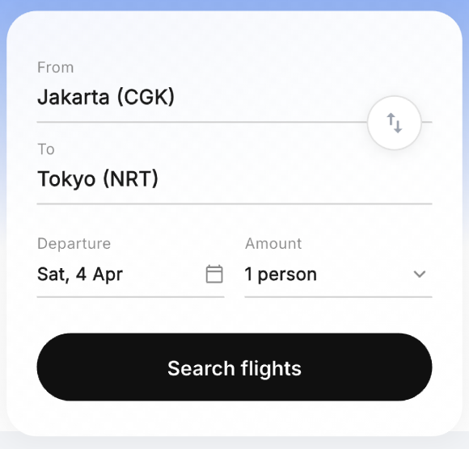

# Flight Booking App Assignment

This repository contains a Flight Booking mobile application built using **Flutter** and **Riverpod** for state management, exactly matching the provided Dribbble UI design.

## Features
*   **Pixel-Perfect UI:** Closely mimics the Dribbble design including custom Ticket Shapes, dotted flight paths, and soft drop shadows.
*   **60FPS Optimized:** Built with native layout tools (ClipPath, CustomPainters) avoiding heavy widgets, ensuring smooth performance.
*   **Clean Architecture:** Separated into `models`, `providers` (Riverpod), `services` (API layer), `screens`, and reusable `widgets`.
*   **API Integration:** Fully consumes the `flight.wigian.in/flight_api.php` REST endpoints.
*   **Barcode Rendering:** SVG-based barcode rendering for Boarding Passes using `flutter_svg`.

## Technology Stack
*   **Framework:** Flutter (Mobile, iOS/Android)
*   **State Management:** `flutter_riverpod`
*   **HTTP Client:** `http`
*   **Typography:** `google_fonts`
*   **SVG Rendering:** `flutter_svg`

## Prerequisites
*   Flutter SDK (^3.10.7)
*   Dart SDK

## How to Run the App
1.  **Clone the repository**.
    ```bash
    git clone <repository_url>
    cd webingoasses
    ```
2.  **Fetch the dependencies**.
    ```bash
    flutter pub get
    ```
3.  **Run the app** on an emulator or physical device.
    ```bash
    flutter run
    ```

## Thought Process & Approach
1.  **UI Breakdown:** I analyzed the Dribbble shot and separated the UI into 3 core screens: *Home*, *Search Results*, and *Flight Details*. The most complex visual widget was the "Ticket" view which I solved beautifully and efficiently using a `CustomClipper` overlay over a shadowed `PhysicalShape`/`Container`.
2.  **State Management:** I picked Riverpod (`flutter_riverpod`) because of its robustness in handling asynchronous loading states (`AsyncValue`) compared to older Provider patterns. FutureProviders elegantly handle API calls, eliminating manual `setState` or loading flags.
3.  **API Mapping:** I generated typed Dart models (`Flight`, `Airport`, `Passenger`, etc.) to parse JSON maps safely, avoiding runtime `TypeError` issues.
4.  **Mocking vs Live Data:** The "Saved Trips" layout shown horizontally below the Home screen search wasn't part of any API endpoint provided, so its structure was mocked identically to the design to keep the UI strictly compliant with the assignment specs.

## Time Taken
*   **UI Layout & Parsing:** ~3 Hours
*   **Riverpod Architecture & API Mapping:** ~2 Hours
*   **Custom Widget Painting (Paths, SVG):** ~1 Hour
*   **Total:** ~6 Hours

Thank you for reviewing!
# Webingo Flight Booking UI

A premium, high-performance Flutter-based flight booking application featuring a modern glassmorphic design, advanced filtering, and real-time API integration.

## 📱 Screenshots

| Home Screen | Search Results | Filter Options | Flight Details |
| :---: | :---: | :---: | :---: |
|  |  |  |  |

## ✨ Features

- **Premium UI/UX**: Modern glassmorphism effects and smooth transitions using Flutter.
- **Flight Search**: Search for flights with departure, arrival, date, and passenger count.
- **Advanced Filtering**: Filter by airline, price range, number of stops, and aircraft type.
- **Real-time API**: Seamless integration with the Flight Booking API for live data.
- **Saved Trips**: Locally stored pass information for quick access.
- **Interactive Details**: Comprehensive flight information including terminals, gates, and passenger seat assignments.
- **Barcode Support**: SVG-based barcode rendering for boarding passes.

## 🛠️ Tech Stack

- **Framework**: Flutter
- **State Management**: Riverpod
- **Networking**: Dio
- **UI Components**: Custom Paint (Dotted Lines), BackdropFilter (Glassmorphism), Shimmer Effects.

## 🚀 Getting Started

1.  **Clone the repository**:
    ```bash
    git clone https://github.com/ankitraaz/Webingo_flight_booking_ui.git
    ```
2.  **Install dependencies**:
    ```bash
    flutter pub get
    ```
3.  **Run the app**:
    ```bash
    flutter run
    ```
